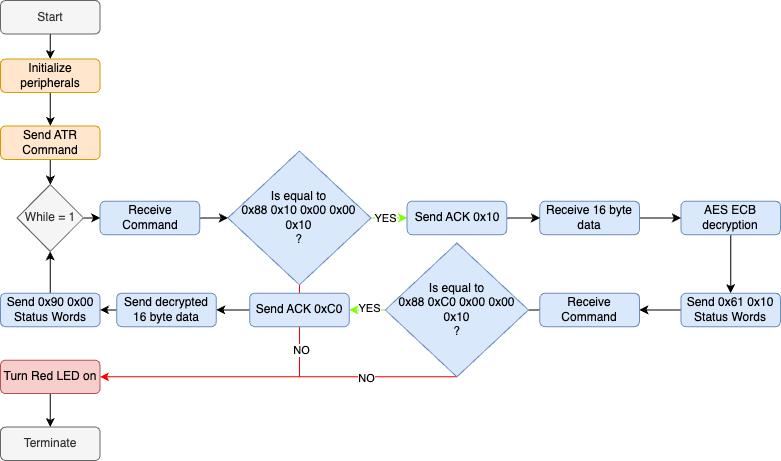
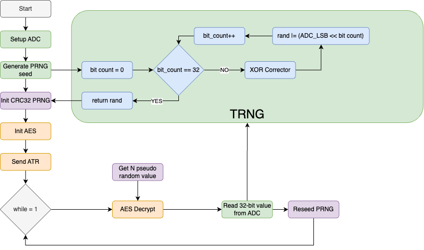
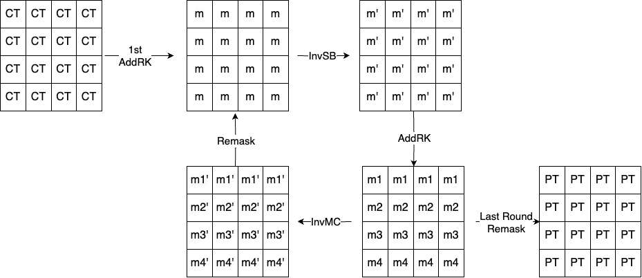

## 1. Stage

### SmartCard OS Implementation & ISO7816-3 Protocol

#### USART Configuration

Steps for SmartCard-compatible USART configuration:

- Configured the packet structure for ISO protocol: 8 data bits, 1 even parity bit, and 1.5 stop bits.
  - `USART1_CR2 |= USART_CR2_STOPBITS_1_5`
  - `USART1_CR1 |= USART_CR1_M | USART_CR1_PCE | USART_CR1_UE`
- Set the correct baud rate `(OS_CLOCK / 372)` and enabled SmartCard mode:
  - `USART1_CR3 |= USART_CR3_SCEN`
- Used polling for communication with custom functions:
  - Data transfer/reception managed by checking transmitter/receiver buffer status.
    - TX: `while (!(USART1_ISR & USART_ISR_TXE))`
    - RX: `while (!(USART1_ISR & USART_ISR_RXNE))`
- As the protocol is half-duplex (single-wire), mode was switched before each packet transfer/reception:
  - `USART1_CR1 |= USART_CR1_TE; USART1_CR1 |= USART_CR1_RE`
  

#### ISO7816-3 Protocol Implementation

Preparations for cloning the protocol:

- Analyzed the reference card communication by monitoring T=0 protocol commands.
- Extracted and understood these commands for implementation on the clone.

To initiate communication, the OS uses the configured USART to send the ATR command before entering the main loop. The protocol is managed within the `start_iso7816` function, which handles all steps for transferring a single packet. These steps are illustrated in the state machine diagram below:

    

> **Note:** Error handling in this implementation is not designed to reflect real-world scenarios thoroughly. The reason is that no errors were encountered during testing. To keep the OS implementation simple, the system responds to errors by lighting a red LED and terminating the program. However, we acknowledge the importance of error correction/recovery mechanisms in real-world applications.

#### AES Implementation

**Optimizations in AES Implementation:**

- The S-Box and Reverse S-Box are precomputed, enabling fast substitution without runtime calculations.
- Galois Field multiplication constants for MixColumns are hardcoded for improved efficiency.
- Fixed memory allocation is used, with no dynamic memory operations.
- All round keys are precomputed and stored in a fixed-size array, reducing runtime overhead.

> **Note:** AES execution time and memory usage details are provided alongside the results of the hardened AES implementations in Stage 2. Please refer to that section for the results.

## 2.Stage

### Hardening of the OS and AES

### TRNG and PRNG Implementation

#### TRNG

The ADC is configured as an entropy source for the True Random Number Generator (TRNG) using the following settings:

- **Noise Sources:** Internal temperature sensor introduce natural variability and noise.
- **Sampling Time:** A sampling time of 13.5 cycles is selected to balance noise capture and conversion speed.
- **Resolution:** The ADC operates at 12-bit resolution.
- **Channel Selection:** Internal temperature sensor channel is sampled to leverage their inherent noise.
- **LSB Extraction and Correction:** Only the least significant bit (LSB) of each conversion is extracted. An XOR-based correction is applied to ensure randomness by introducing variability into the raw LSB sequence.

This configuration ensures a high-quality entropy source for cryptographic and security applications.

A 32-bit random number is generated by performing 32 ADC conversions. The least significant bit (LSB) of each result, capturing noise and jitter, is extracted and processed using an XOR-based approach. In this method, the LSBs of two consecutive ADC conversions are XORed to generate a new bit, which adds randomness and reduces correlation between consecutive bits. The resulting bits are then packed into a 32-bit value, and the final random number is returned for use.

#### PRNG

As a PRNG, SHA-256, which is cryptographically secure, was initially tested. However, due to its operational latency, countermeasure-enabled operating systems failed to decrypt the video stream in time, leading to timeouts. For this reason, CRC32, a lightweight and faster alternative, was used for pseudo-random number generation, despite not being cryptographically secure.

To enhance its security, the CRC32 seed is reinitialized by reading a new 32-bit value from the ADC after decrypting each video stream packet. This approach aims to provide an additional layer of security, compensating for the lack of cryptographic strength in CRC32.

> **Note:** It is acknowledged that CRC32 is traditionally used for error correction and checksums, and may not meet the security requirements of real-world scenarios. However, it was chosen as a practical solution to successfully achieve the milestones for this laboratory course.

The core CRC32 code was sourced from GitHub ([crc32.c](https://github.com/gcc-mirror/gcc/blob/master/libiberty/crc32.c)) and modified as necessary before being integrated into the operating system.

Below is a flowchart illustrating the TRNG and PRNG process, showing the steps involved in random number generation.

    

#### AES Countermeasures

##### Shuffling

The shuffling countermeasure is implemented as follows:

- **Permutation Creation**:

  - A permutation array of 16 elements was generated, with each element representing an index in the AES state array.
  - The **Fisher-Yates algorithm**, combined with the CRC-32 PRNG, was used to shuffle the array, ensuring randomization.

- **Shuffled AES Operations**:
  - The permutation was applied during the `AddRoundKey` and `InvSubBytes` stages of AES decryption.
  - The permutation determined the order of state and key accesses, randomizing the execution sequence of these critical operations.

##### Dummy Operations

The dummy operations countermeasure is implemented as follows:

- **Fixed Number of Operations**: A total of **100** dummy inverse sub-byte operations are added per AES decryption. This fixed count prevents attackers from deducing information. The value is adjustable via a macro.

- **Dummy Operation Logic**:

  - A random byte is generated using the PRNG, its inverse S-box value is computed, and the result is XORed with a final dummy result to ensure inclusion in computations.
  - To prevent the compiler from optimizing dummy operations, results are stored in a `volatile` variable.

- **Random Distribution**:

  - Dummy operations are randomly allocated across AES rounds using the PRNG.
  - Remaining operations are added to the final round to maintain the total count.

- **Random Ordering**: Within each round, dummy operations are inserted either before or after the actual inverse sub-byte operation with a 50% probability determined by the PRNG.

##### Masking

The masking countermeasure is implemented as follows:

- **10 Masks**: `m1-m4`, `m`, `m'`, and `m1'-m4'` are utilized. `m1-m4`, `m`, and `m'` are generated via PRNG, while `m1'-m4'` are derived from `m1-m4`.
- **InvSubBytes Masks**: `m` and `m'` are applied as input and output masks during `InvSubBytes`, including masked reverse S-box creation.
- **InvMixColumns Masks**: `m1-m4` are input masks, while `m1'-m4'` serve as output masks.
- **Decryption Flow**: Mask Initialization → Masked AddRK → [InvSR → Masked InvSB → Masked AddRK → (InvMC → ReMask)] → Final ReMask.
- All these steps are performed within the AES decryption function.

    

#### OS and AES Results

<strong>Execution Time</strong>

<table style="border-collapse: collapse; width: 100%; font-size: 10px;">
<tr>
<th>Implementation</th>
<th>Time [ms]</th>
<th>Improvement [%]</th>
</tr>
<tr>
<td>Reference card (no countermeasure)</td>
<td>54.1</td>
<td>N/A</td>
</tr>
<tr>
<td>Own implementation (no countermeasure)</td>
<td>51.5</td>
<td>4.80%</td>
</tr>
<tr>
<td>Own implementation + Dummy Operations</td>
<td>53.9</td>
<td>0.37%</td>
</tr>
<tr>
<td>Own implementation + Shuffling</td>
<td>51.8</td>
<td>4.26%</td>
</tr>
<tr>
<td>Own implementation + Masking</td>
<td>53.7</td>
<td>0.74%</td>
</tr>
<tr>
<td>Own implementation + All 3</td>
<td>56.6</td>
<td>-4.63%</td>
</tr>
</table>

 

<strong>Memory Usage</strong>

<table style="border-collapse: collapse; width: 100%; font-size: 10px;">
<tr>
<th>Implementation</th>
<th>Text [kB]</th>
<th>Data [B]</th>
<th>BSS [B]</th>
<th>Total [B]</th>
<th>Difference [%]</th>
</tr>
<tr>
<td>Own implementation (no countermeasure)</td>
<td>3.8</td>
<td>8</td>
<td>176</td>
<td>3952</td>
<td>N/A</td>
</tr>
<tr>
<td>Own implementation + Dummy Operations</td>
<td>5.856</td>
<td>28</td>
<td>192</td>
<td>6036</td>
<td>+52.77%</td>
</tr>
<tr>
<td>Own implementation + Shuffling</td>
<td>5.716</td>
<td>28</td>
<td>192</td>
<td>5972</td>
<td>+51.15%</td>
</tr>
<tr>
<td>Own implementation + Masking</td>
<td>6372</td>
<td>28</td>
<td>448</td>
<td>6532240</td>
<td>+165131.17%</td>
</tr>
<tr>
<td>Own implementation + All 3</td>
<td>660</td>
<td>28</td>
<td>452</td>
<td>676460</td>
<td>+16920.28%</td>
</tr>
</table>

